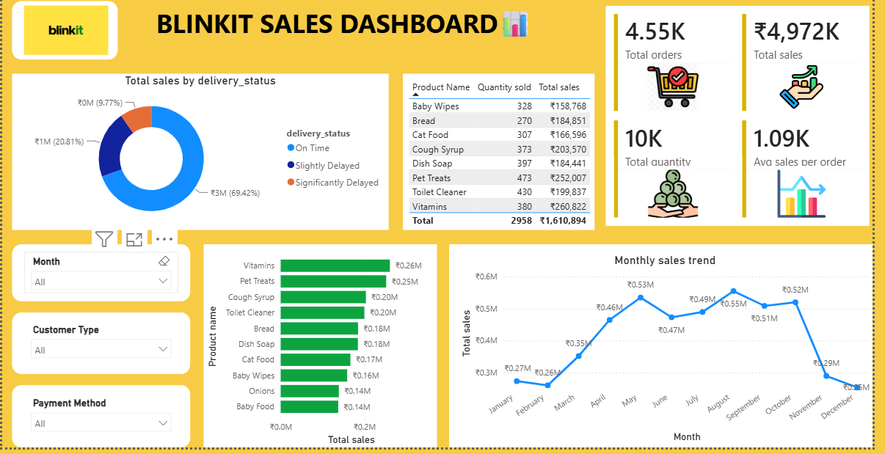

# Blinkit Sales Analytics Dashboard

An interactive **Power BI dashboard** designed to analyze Blinkit sales performance, order trends, product performance, delivery status, and customer payment patterns.

## Project Overview

This project uses **Power BI** to transform sales data into an interactive business analytics dashboard. The dashboard provides a consolidated view of key sales and operational metrics, allowing users to explore performance using interactive filters and visualizations.

## Key KPIs

* **Total Orders**
* **Total Sales**
* **Total Quantity**
* **Average Sales per Order**

## Dashboard Features

### Sales and Operations Overview

The dashboard provides insights into overall sales performance and operational activity through interactive KPI cards and visualizations.

Key insights include:

* Overall sales performance
* Total order volume
* Total quantity sold
* Average sales per order
* Delivery status distribution
* Product-level sales performance
* Monthly sales trends
* Interactive filtering for detailed analysis

### Interactive Filters

Users can dynamically filter and explore the dashboard using:

* **Month**
* **Customer Type**
* **Payment Type**

## Visualizations

The dashboard includes the following visualizations:

* **Sales by Delivery Status**
* **Monthly Sales Trend**
* **Sales by Product**
* **Product Quantity**
* **Sales Table**
* **KPI Cards** for key business performance metrics

## Tools and Technologies

* **Power BI**
* **DAX**
* **Data Visualization**
* **Data Analysis**
* **Data Transformation**

## Dashboard Preview

### Blinkit Sales Dashboard Overview

## Skills Demonstrated

* Power BI Dashboard Development
* DAX
* KPI Development
* Data Visualization
* Business Analytics
* Interactive Reporting
* Sales Analysis

## Author

**Prerna Thakur**
Computer Science and Data Analytics Student
